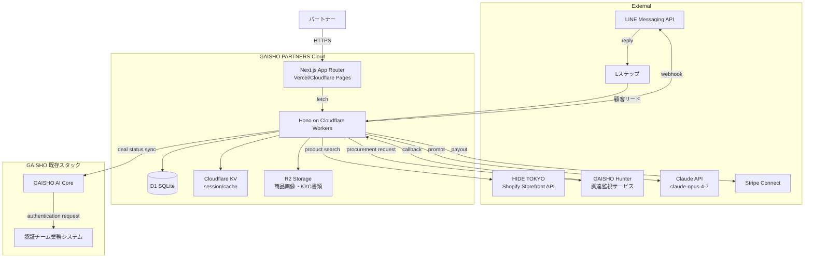
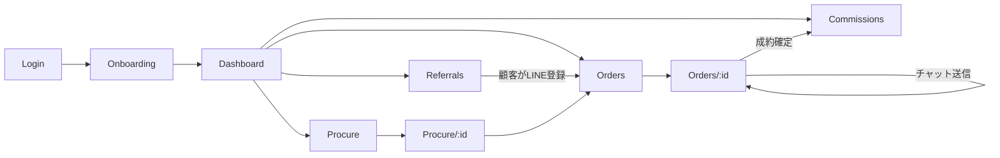

# GAISHO PARTNERS Cloud — 仕様書 v1.0

> エンジニア向け、実装着手可能なレベル。MVP境界を明示。

---

## 1. 概要・スコープ・MVP境界

### 1.1 概要
GAISHO PARTNERS Cloud は、富裕層接点保有者（パートナー）が GAISHO の基幹インフラを利用してラグジュアリー商品の販売を行うための SaaS。

### 1.2 ユーザー価値
- パートナー：顧客紹介から成約コミッション着金までを一気通貫で管理
- 顧客：パートナー経由でGAISHOの調達・認証・配送を利用
- GAISHO本部：パートナー審査・案件モニタリング・不正検知

### 1.3 MVP 境界

| 機能 | MVP | Phase 2 | Phase 3 |
|------|-----|---------|---------|
| パートナー登録・KYC | ✅ | | |
| LINEリンク生成 | ✅ | | |
| 商品検索（HIDE TOKYO API） | ✅ | | |
| GAISHO Hunter 連携 | | ✅ | |
| コミッション計算 | ✅ | | |
| Academy 受講管理 | | ✅ | |
| 支払い自動化（Stripe Connect） | | ✅ | |
| メンター 1on1 予約 | | | ✅ |
| API 公開（B2B連携） | | | ✅ |

---

## 2. ユーザーロール定義

| ロール | 説明 | 主要権限 |
|--------|------|---------|
| `partner` | 個人パートナー | 自分の案件・コミッションのみ閲覧 |
| `partner_corp` | 法人パートナー（複数アカウント） | 配下スタッフの案件閲覧 |
| `customer` | エンドユーザー | LINE経由のみ。Web UIは持たない |
| `mentor` | パートナー育成担当 | 担当パートナーの案件・進捗閲覧 |
| `concierge` | 案件処理オペレーター | 全案件閲覧・編集 |
| `admin` | GAISHO本部管理者 | 全機能・全データ |
| `auditor` | 監査役（外部含む） | 読み取り専用 |

---

## 3. システム全体アーキテクチャ



---

## 4. 主要ユースケース一覧

### 4.1 パートナー視点
- UC-P-01：エントリーする
- UC-P-02：Academy を受講する
- UC-P-03：顧客紹介LINEリンクを発行する
- UC-P-04：顧客の調達依頼を起票する
- UC-P-05：見積もりを顧客に提示し合意を取る
- UC-P-06：受注後の進捗を確認する
- UC-P-07：コミッション支払い状況を確認する

### 4.2 顧客視点（LINEのみ）
- UC-C-01：パートナーから紹介LINEで招待される
- UC-C-02：AIまたはパートナーに商品を相談する
- UC-C-03：見積もり提示を受ける／承諾する
- UC-C-04：配送状況を確認する
- UC-C-05：アフターサービスを依頼する

### 4.3 管理者視点
- UC-A-01：パートナー新規申込を審査する
- UC-A-02：全案件をモニタリングする
- UC-A-03：月次コミッションを集計・承認する
- UC-A-04：不正検知アラートを処理する
- UC-A-05：Academy 修了ステータスを管理する

### 4.4 メンター視点
- UC-M-01：担当パートナー一覧を見る
- UC-M-02：個別の進捗・成約に対してメモを残す
- UC-M-03：1on1 を予約する（Phase 3）

---

## 5. 画面一覧と画面遷移図

### 5.1 画面一覧

#### パートナー向け（`/`）
| パス | 画面 | MVP |
|------|------|-----|
| `/` | ログイン | ✅ |
| `/onboarding` | 初回ウォークスルー | ✅ |
| `/dashboard` | ダッシュボード（KPI概要） | ✅ |
| `/referrals` | 顧客紹介リンク管理 | ✅ |
| `/procure` | 商品検索 | ✅ |
| `/procure/[id]` | 商品詳細 | ✅ |
| `/orders` | 受発注一覧 | ✅ |
| `/orders/[id]` | 案件詳細・チャット | ✅ |
| `/commissions` | コミッション履歴 | ✅ |
| `/academy` | Academy 受講状況 | Phase 2 |
| `/settings` | プロフィール・支払い口座 | ✅ |

#### 管理者向け（`/admin`）
| パス | 画面 | MVP |
|------|------|-----|
| `/admin` | 管理ダッシュボード | ✅ |
| `/admin/partners` | パートナー一覧・審査 | ✅ |
| `/admin/partners/[id]` | パートナー詳細 | ✅ |
| `/admin/deals` | 全案件モニタリング | ✅ |
| `/admin/commissions` | 月次コミッション集計 | ✅ |
| `/admin/alerts` | 不正検知アラート | Phase 2 |
| `/admin/academy` | Academy 受講状況一覧 | Phase 2 |

### 5.2 画面遷移図（パートナー視点 MVP）



---

## 6. 各画面の機能仕様

各画面は **目的 / 主要要素 / 振る舞い / エッジケース** の4項目で記述。

### 6.1 パートナー登録・KYC（`/onboarding`）

**目的**：本人確認とプロフィール初期設定。

**主要要素**：
- 本人確認書類アップロード（運転免許 / マイナンバーカード）
- 顔写真撮影（書類との照合用）
- 想定顧客層の自己申告（複数選択）
- 振込口座登録（Stripe Connect 経由）
- 利用規約・業務委託契約への同意

**振る舞い**：
- アップロードはR2に直接マルチパート。サムネ生成後、KYC審査キューに入る
- ステータスは `pending` → `approved` / `rejected`
- 承認まで `/dashboard` 等の主要機能はロック

**エッジケース**：
- KYC書類の文字読み取り失敗 → 再撮影プロンプト
- 同一書類の二重登録 → 重複チェックで拒否
- Stripe Connect の本人確認が GAISHO 側より緩い場合 → 厳しい方を採用

---

### 6.2 ダッシュボード（`/dashboard`）

**目的**：今月のパフォーマンスを30秒で把握。

**主要要素**：
1. 今月の成約数 / 売上 / コミッション見込み
2. 進行中の案件カード（最大5件、状態別バッジ）
3. 紹介LINEリンクのQR表示・ワンタップコピー
4. 月次パフォーマンスチャート（過去6ヶ月）
5. お知らせフィード（メンターからの連絡・本部からの通達）

**振る舞い**：
- データは `/api/dashboard` から取得（一括）
- リアルタイム更新はWebSocket（Cloudflare Durable Objects）

**エッジケース**：
- 初成約前 → 「今月の成約 0件」を強調せず、紹介リンクの案内を全面表示
- 月をまたぐタイミング → JST 00:00 で表示切替

---

### 6.3 顧客紹介リンク管理（`/referrals`）

**目的**：パートナー固有のLINE導線を生成・分析する。

**主要要素**：
- パートナー固有のLINE QR / URL
- 紹介リンクを目的別に複製生成（タグ付け：例「銀座店経由」「ゴルフ仲間経由」）
- 各リンクごとの招待数 / 案件化率
- LINEの導入文テンプレート（コピペで使える）

**振る舞い**：
- 招待リンクは `https://line.me/R/ti/p/@gaishoai?P={partnerId}-{tag}` 形式
- 顧客が登録すると Lステップ Webhook 経由で `customers` テーブルに保存
- 同時に `referrals` テーブルに紹介履歴を残す

**エッジケース**：
- 顧客が複数パートナーから紹介された → 最初に登録したパートナーに帰属（30日ロック）
- ロック期間後の再紹介 → 新規パートナーに付け替え可

---

### 6.4 商品検索（`/procure`）

**目的**：顧客のリクエストに合う商品を見つける。

**主要要素**：
- 検索バー（自由文 / カテゴリー / ブランド / 価格レンジ）
- フィルタ：在庫種別（HIDE TOKYO即納 / GAISHO Hunter調達依頼 / 並行輸入予約）
- 検索結果カード：画像 / ブランド / 型番 / 仕入れ価格 / 想定販売価格 / 想定コミッション
- 「顧客に提案」ボタン → `/orders` で新規案件起票

**振る舞い**：
- 検索は `/api/products/search` を叩く
- 即納在庫は HIDE TOKYO Shopify Storefront API
- 調達依頼は GAISHO Hunter にPOSTし、見つかったらWebhookで通知

**エッジケース**：
- 価格が顧客提示後に大幅変動 → 自動でパートナーにアラート、再提案フロー

---

### 6.5 案件詳細（`/orders/[id]`）

**目的**：1案件の全情報・全コミュニケーションを集約する。

**主要要素**：
- 案件ステータス（`draft / quoted / agreed / procuring / shipping / delivered / closed`）
- 顧客情報（氏名・LINEアイコン・購入履歴）※他パートナーから完全に遮断
- 商品情報・見積もり履歴
- チャットスレッド（パートナー⇄顧客、パートナー⇄GAISHO本部）
- 配送トラッキング
- 成約後のレビュー

**振る舞い**：
- ステータス遷移はバックエンドが管理し、UIは購読のみ
- チャットは LINE と Web UI で双方向同期（パートナーがWebで打った内容がLINEに飛ぶ）

**エッジケース**：
- 顧客がLINEブロック → ステータスをアラート表示。GAISHO本部に通知
- パートナーが長期不在（48h未返信） → 自動的に GAISHO本部にエスカレーション

---

### 6.6 コミッション履歴（`/commissions`）

**目的**：いつ・いくら入るのかを明確に。

**主要要素**：
- 月別サマリ（確定 / 未確定 / 支払い済）
- 案件別明細（売上 / 手数料 / コミッション率 / 着金日）
- 確定申告用のCSVダウンロード

**振る舞い**：
- 月末締め → 翌月10日確定 → 翌月15日支払い（Stripe Connect 自動振込）
- コミッション率は契約ステージ・実績に応じて自動算出（後述）

---

### 6.7 設定（`/settings`）

**目的**：プロフィール・通知・支払い情報の管理。

**主要要素**：
- プロフィール（表示名・自己紹介・対応エリア）
- 通知設定（LINE / Email / SMS）
- 支払い口座（Stripe Connect ダッシュボード遷移）
- 業務委託契約書のダウンロード
- 退会申請

---

### 6.8 管理画面（`/admin/*`）

#### 6.8.1 パートナー審査キュー（`/admin/partners`）
- 未審査一覧。書類画像 / 自己申告 / メンター推薦の有無
- アクション：承認 / 差戻 / 拒否
- 拒否時は拒否理由をテンプレートから選択 → 自動メール送信

#### 6.8.2 全案件モニタリング（`/admin/deals`）
- ステータス別タブ / フィルタ
- 異常検知ハイライト（金額が想定の3倍以上 / 同一顧客への大量発注 等）

#### 6.8.3 月次コミッション集計（`/admin/commissions`）
- 月別パートナー別コミッション集計
- ボタン1つで支払い実行（Stripe一括）

---

## 7. データモデル

### 7.1 主要テーブル（Prisma風スキーマ）

```prisma
model Partner {
  id              String   @id @default(cuid())
  type            PartnerType  // INDIVIDUAL | CORPORATE
  email           String   @unique
  phone           String
  displayName     String
  kycStatus       KycStatus    // PENDING | APPROVED | REJECTED
  kycDocs         Json         // R2 のキー配列
  stripeAccountId String?
  contractTier    Int          @default(1)   // 1〜5。コミッション率に影響
  mentorId        String?
  createdAt       DateTime @default(now())
  updatedAt       DateTime @updatedAt

  referrals       Referral[]
  orders          Order[]
  commissions     Commission[]
  staffOf         Partner?     @relation("CorpStaff", fields: [parentId], references: [id])
  parentId        String?
  staff           Partner[]    @relation("CorpStaff")
}

model Customer {
  id             String   @id @default(cuid())
  lineUserId     String   @unique
  displayName    String
  ownerPartnerId String           // 30日帰属ロックあり
  lockedUntil    DateTime
  totalSpent     Int      @default(0)
  createdAt      DateTime @default(now())

  orders         Order[]
}

model Referral {
  id          String   @id @default(cuid())
  partnerId   String
  tag         String?
  visits      Int      @default(0)
  signups     Int      @default(0)
  createdAt   DateTime @default(now())
}

model Product {
  id              String   @id @default(cuid())
  source          ProductSource  // HIDE_TOKYO | HUNTER | PARALLEL
  externalId      String         // HIDE TOKYO Shopify ID 等
  brand           String
  model           String
  imageUrls       Json
  costPrice       Int            // 仕入れ価格（円）
  listPrice       Int            // 想定販売価格（円）
  inStock         Boolean
  metadata        Json
}

model Order {
  id          String   @id @default(cuid())
  partnerId   String
  customerId  String
  productId   String?
  status      OrderStatus
  amount      Int             // 顧客請求額
  costAmount  Int             // 原価
  commission  Int             // パートナー取り分（円）
  feeRate     Float           // 適用コミッション率
  chatThreadId String
  createdAt   DateTime  @default(now())
  closedAt    DateTime?
}

model Commission {
  id          String   @id @default(cuid())
  partnerId   String
  orderId     String
  amount      Int
  status      CommissionStatus  // PENDING | CONFIRMED | PAID
  paidAt      DateTime?
}

model AcademyProgress {
  id          String   @id @default(cuid())
  partnerId   String
  moduleId    String
  completed   Boolean  @default(false)
  completedAt DateTime?
}

model AuditLog {
  id          String   @id @default(cuid())
  actorId     String
  actorRole   String
  action      String
  target      String
  meta        Json
  createdAt   DateTime @default(now())
}

enum PartnerType { INDIVIDUAL CORPORATE }
enum KycStatus { PENDING APPROVED REJECTED }
enum ProductSource { HIDE_TOKYO HUNTER PARALLEL }
enum OrderStatus { DRAFT QUOTED AGREED PROCURING SHIPPING DELIVERED CLOSED CANCELLED }
enum CommissionStatus { PENDING CONFIRMED PAID }
```

### 7.2 TypeScript 型定義（フロント共有）

```typescript
export type PartnerTier = 1 | 2 | 3 | 4 | 5;

export interface DashboardSnapshot {
  partnerId: string;
  month: string;            // "2026-05"
  stats: {
    closedDeals: number;
    revenue: number;
    commissionConfirmed: number;
    commissionPending: number;
  };
  activeOrders: OrderSummary[];
  notifications: Notification[];
}

export interface OrderSummary {
  id: string;
  customerName: string;
  productLabel: string;
  amount: number;
  status: OrderStatus;
  updatedAt: string;
}
```

---

## 8. API 仕様

### 8.1 ベース
- スタック：Hono on Cloudflare Workers
- パス：`/api/v1/*`
- 認証：Bearer Token（JWT）／Clerk セッション

### 8.2 主要エンドポイント

| Method | Path | 説明 | 認可 |
|--------|------|------|------|
| POST | `/api/v1/auth/login` | パートナーログイン | public |
| GET | `/api/v1/dashboard` | ダッシュボードデータ | partner |
| GET | `/api/v1/referrals` | 紹介リンク一覧 | partner |
| POST | `/api/v1/referrals` | 紹介リンク作成 | partner |
| GET | `/api/v1/products/search` | 商品検索 | partner |
| POST | `/api/v1/orders` | 案件起票 | partner |
| GET | `/api/v1/orders/:id` | 案件詳細 | partner / concierge |
| PATCH | `/api/v1/orders/:id` | 案件更新 | partner / concierge |
| POST | `/api/v1/orders/:id/messages` | チャット送信 | partner / concierge |
| GET | `/api/v1/commissions` | コミッション履歴 | partner |
| POST | `/api/v1/webhooks/line` | LINE Webhook | line (署名検証) |
| POST | `/api/v1/webhooks/hunter` | Hunter Webhook | hunter (HMAC) |
| POST | `/api/v1/webhooks/stripe` | Stripe Connect Webhook | stripe |
| GET | `/api/v1/admin/partners` | パートナー一覧 | admin |
| POST | `/api/v1/admin/partners/:id/approve` | KYC承認 | admin |
| POST | `/api/v1/admin/commissions/payout` | 月次支払い実行 | admin |

### 8.3 エラーフォーマット

```json
{
  "error": {
    "code": "VALIDATION_FAILED",
    "message": "顧客IDが見つかりません",
    "details": [{ "field": "customerId", "rule": "exists" }]
  }
}
```

---

## 9. 既存システムとの連携ポイント

### 9.1 LINE Harness OSS
- 用途：LINE Messaging API のラッパ
- 連携IF：
  - `LineHarness.sendQuoteCard(customerId, quote)`：見積もりカード送信
  - `LineHarness.onCustomerMessage(handler)`：受信ハンドラ

### 9.2 HIDE TOKYO Shopify Storefront API
- 用途：在庫検索・商品詳細取得
- 連携IF：
  - `GET /products?query={q}` → Storefront API 経由
  - 認証：Storefront Access Token（環境変数）

### 9.3 GAISHO Hunter
- 用途：海外サイトの在庫監視・調達依頼
- 連携IF：
  - `POST /hunter/requests { brand, model, maxPrice }`
  - 発見時 Webhook：`POST /api/v1/webhooks/hunter`

### 9.4 Lステップ
- 用途：LINEリードのナーチャリング
- 連携IF：
  - 紹介リンク登録時に Lステップ tag 自動付与
  - ステージ進行時に WebHookで Partner Cloud に通知

### 9.5 Claude API
- 用途：商品提案文の下書き生成・FAQ回答
- モデル：`claude-opus-4-7`（高難度提案）／`claude-sonnet-4-6`（通常返答）
- プロンプトキャッシュ：パートナーの自己紹介・顧客プロファイルをシステムプロンプトに置きキャッシュ

---

## 10. 認証・権限設計

### 10.1 認証
- パートナー：Clerk（Email + Password / Google）
- 顧客：LINE Login（Webアプリには来ない、IDのみ）
- 管理者：Clerk（SSO 必須・MFA 必須）

### 10.2 RBAC

```typescript
const PERMISSIONS = {
  partner: ['order:read:own', 'order:create', 'commission:read:own'],
  partner_corp: ['order:read:staff', 'commission:read:staff'],
  mentor: ['order:read:assigned', 'partner:read:assigned'],
  concierge: ['order:*', 'product:*'],
  admin: ['*'],
  auditor: ['*:read'],
};
```

### 10.3 マルチテナント遮断
- パートナー間の顧客情報は **完全遮断**（顧客IDをパートナーIDでスコープ）
- 同じ顧客が複数パートナーに紐づく場合も、互いに存在を知ることはできない（30日ロック方式）

---

## 11. コミッション計算ロジック

### 11.1 基本式
```
GAISHO手数料 = 顧客請求額 - 商品原価 - 配送実費 - 認証実費
パートナーコミッション = GAISHO手数料 × コミッション率
```

### 11.2 コミッション率テーブル

| Tier | 過去3ヶ月成約数 | コミッション率 |
|------|---------------|--------------|
| 1 (Entry) | 0〜2件 | 30% |
| 2 (Bronze) | 3〜5件 | 35% |
| 3 (Silver) | 6〜10件 | 40% |
| 4 (Gold) | 11〜20件 | 45% |
| 5 (Platinum) | 21件以上 | 50% |

Tier は毎月1日 00:00 JST に自動再計算。

### 11.3 例外ケース
- **キャンセル**：見積もり段階 → 0円、調達後 → 仕入れ価格の10%を補填
- **返品**：顧客都合 → コミッション返還、GAISHO都合 → コミッション維持
- **複数パートナー競合**：30日帰属ロックで最初のパートナーに帰属
- **法人パートナーの内部分配**：法人パートナーが自社内で分配（システムは関与しない）

---

## 12. 法務・コンプライアンス論点

### 12.1 業務委託契約
- 雇用契約ではない（労基法非適用）
- 契約書テンプレートは法務監修
- 反社チェック必須

### 12.2 古物商許可
- 売買主体はGAISHO（古物商許可保有）
- パートナーは「商品紹介・顧客対応」のみで売買主体にならない
- 商品の所有権移転はGAISHO→顧客の直接ライン

### 12.3 特定商取引法
- 通信販売の特定商取引法に基づく表記はGAISHO名義
- パートナー個人名は表示しない

### 12.4 景品表示法
- 「世界最安」「業界最大」等の優良誤認表示は禁止
- Academy で全パートナーに教育

### 12.5 個人情報保護
- パートナー間の顧客情報遮断
- 顧客情報の保管は GAISHO 本体のシステム
- パートナーが扱えるのは顧客の表示名・連絡履歴のみ（住所等は本部のみ）

### 12.6 関税法・並行輸入
- 商品は GAISHO 名義で輸入
- 並行輸入であることを商品ページに明示
- 商標権侵害リスク管理（並行輸入は合法だが、改造品は不可）

---

## 13. KPI・計測設計

### 13.1 北極星KPI
- 月次パートナー成約GMV（Gross Merchandise Volume）

### 13.2 サブKPI

| カテゴリ | KPI | 目標 |
|---------|-----|------|
| パートナー獲得 | 月次新規パートナー数 | 30名/月 |
| アクティブ率 | MAP（月次成約パートナー率） | 60% |
| 成約効率 | リード→成約率 | 15% |
| 顧客単価 | 平均成約金額 | ¥1.2M |
| 継続率 | 6ヶ月パートナー継続率 | 80% |
| NPS | パートナーNPS | +40 |

### 13.3 計測実装
- フロント：PostHog（イベント追跡）
- バックエンド：構造化ログ（Workers Logpush → BigQuery）

---

## 14. リリースフェーズ

### α（〜2026-08）
- 内部パートナー10名のみで運用
- 主要画面のみ実装、運用は半手動
- 目的：オペレーションの当たり付け

### β（〜2026-12）
- 招待制で30名まで拡大
- KYC・コミッション計算自動化
- Academy のオンライン化

### GA（2027-01〜）
- 一般募集開始
- 法人パートナー受付開始
- 目的：年内100パートナー / GMV 月3億

---

## 15. 非機能要件

- 稼働率：99.9%（月次ダウンタイム43分以内）
- レスポンス：p95 300ms 以内（読み取り）／1s 以内（書き込み）
- セキュリティ：OWASP Top 10 を網羅。月次脆弱性スキャン
- バックアップ：D1 日次スナップショット、R2 オブジェクトはバージョニング保持
- 監査ログ：全Write操作を AuditLog テーブルに保存。1年保持

---

## 16. 将来検討

- パートナーアプリ（iOS / Android）
- 多言語対応（中国語繁体・英語）
- 海外パートナー（シンガポール・ドバイ）
- リセール市場対応（GAISHO 経由の中古ラグジュアリー販売）
- ホワイトラベル（百貨店ブランドでGAISHO Cloud を提供）
